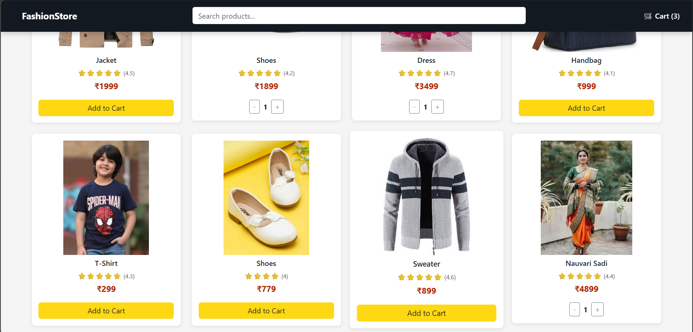
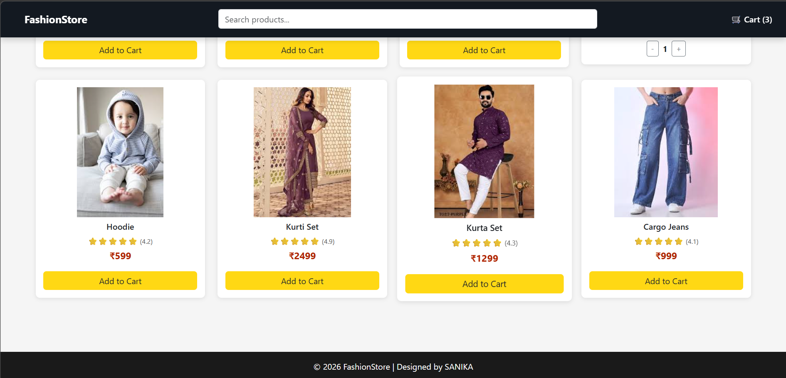
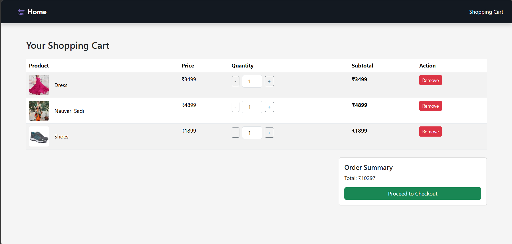

# Assignment 3: E-Commerce Website

## Problem Statement
Design and develop a basic e-commerce website interface that allows users to browse products and interact with a shopping cart using HTML, CSS, and JavaScript.

## Objective
- To understand the structure of an e-commerce webpage.
- To implement product display and cart interaction.
- To practice frontend development using HTML, CSS, and JavaScript.
- To enhance user interface design and webpage functionality.

## Technologies Used
- HTML
- CSS
- JavaScript

## Description
This assignment demonstrates the development of a simple e-commerce web application interface. The webpage allows users to view products and interact with a basic shopping cart functionality.

HTML is used to create the webpage structure, CSS is applied for styling and layout, and JavaScript is used to add interactivity such as adding items to the cart and handling user actions.

The website includes product display sections, navigation elements, and a cart page where selected items can be viewed.

## Features
- Product listing with images and details.
- Add to cart functionality using JavaScript.
- Simple and responsive webpage layout.
- Separate cart page to view selected items.

## Folder Structure
Ass3_Ecommerce app
│
├── index.html
├── cart.html
├── style.css
├── script.js
├── banner1.jpg
├── README.md
└── Outputs
    ├── 1.png
    ├── 2.png
    ├── 3.png
    └── 4.png

## Output

### Output 1

### Output 2

### Output 3

### Output 4

## Conclusion
This assignment helped in understanding how an e-commerce website interface works. It provided practical experience in building interactive web pages using HTML, CSS, and JavaScript and implementing basic shopping cart functionality.