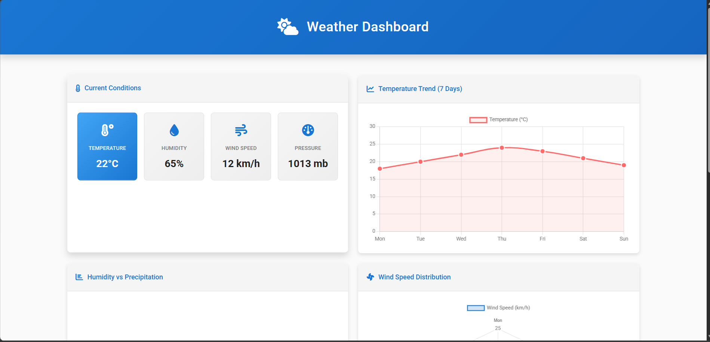
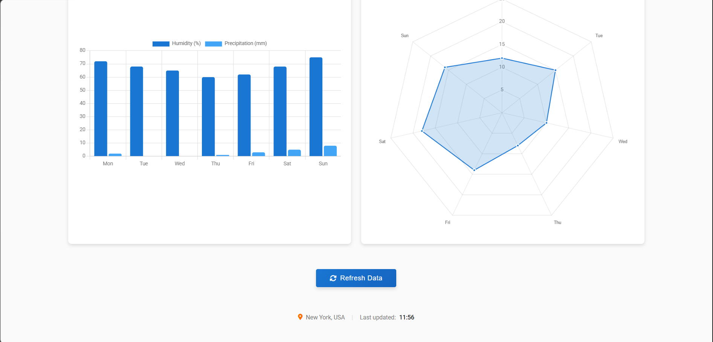

# Assignment 4: Weather Dashboard

## Problem Statement

Design and develop an interactive weather dashboard that visualizes weather data using charts and graphs. The dashboard should display current weather conditions and trends using JavaScript libraries like Chart.js.

## Objective

* To understand the development of a real-time data visualization dashboard.
* To implement charts and graphs for weather data representation.
* To practice frontend development using HTML, CSS, and JavaScript.
* To enhance UI/UX design with interactive elements.

## Technologies Used

* HTML
* CSS
* JavaScript
* Chart.js

## Description

This assignment demonstrates the development of an interactive weather dashboard interface. The application displays current weather conditions such as temperature, humidity, wind speed, and pressure.

Charts are used to visualize weather trends, including temperature changes over time, humidity vs precipitation comparison, and wind speed distribution.

HTML is used to structure the webpage, CSS is applied for styling and layout, and JavaScript is used to implement dynamic data updates and interactive charts using the Chart.js library.

The dashboard also includes a refresh feature that updates the data dynamically and improves user interaction.

## Features

* Display of current weather statistics (Temperature, Humidity, Wind Speed, Pressure).
* Interactive charts:

  * Temperature trend (Line Chart)
  * Humidity vs Precipitation (Bar Chart)
  * Wind speed distribution (Pie Chart)
* Dynamic data update using JavaScript.
* Responsive and modern UI design.
* Refresh button to simulate real-time updates.

## Folder Structure

Ass4_Weather Dashboard
│
├── index.html
├── style.css
├── script.js
├── README.md
└── Outputs
    ├── 1.png
    ├── 2.png

## Output

### Output 1

### Output 2

## Conclusion

This assignment provided practical experience in building an interactive data visualization dashboard. It helped in understanding how to represent real-world data using charts and graphs, and how to enhance user interaction using JavaScript. The project also improved frontend development skills and UI design concepts.
