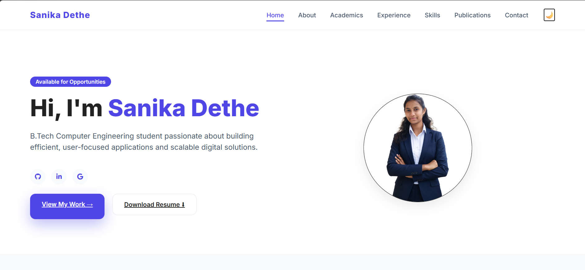
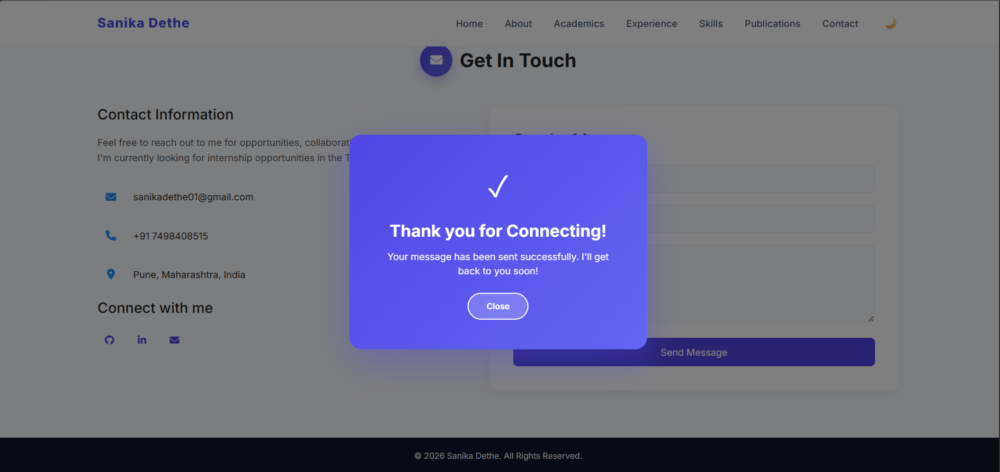

# Assignment 5: Portfolio Website with MongoDB Integration

## Problem Statement
Develop a dynamic portfolio website using Node.js and Express, and connect it with a NoSQL database (MongoDB) to store and manage data.

## Objective
- To build a full stack web application.
- To integrate frontend with backend using Node.js and Express.
- To connect and perform operations using MongoDB.
- To manage dynamic data such as contact form or user details.

## Technologies Used
- HTML  
- CSS  
- JavaScript  
- Node.js  
- Express.js  
- MongoDB  

## Description
This assignment demonstrates the development of a dynamic portfolio website integrated with a backend server and database.

The frontend is designed using HTML and CSS to showcase personal information, projects, and contact details. The backend is developed using Node.js and Express to handle routing and server-side logic.

MongoDB is used as a NoSQL database to store and retrieve data such as user inputs from forms (e.g., contact details). The application enables interaction between frontend and backend, making the website dynamic and functional.

## Features
- Personal portfolio interface.
- Backend server using Express.js.
- MongoDB database integration.
- Data storage and retrieval (e.g., contact form submissions).
- Organized project structure (frontend + backend).
- Responsive and clean UI.

## Steps to Run the Project

### 1. Install Dependencies
- npm install

### 2. Setup MongoDB
- Install MongoDB locally OR use MongoDB Atlas.
- Create a database and collection.
- Update the MongoDB connection string in `.env` or `server.js`.

### 3. Run the Server
- node server.js

or

- nodemon server.js

## Folder Structure

Ass5_mongodb connection
│
├── backend
│ ├── models
│ ├── node_modules
│ ├── .env.example
│ ├── package.json
│ └── server.js
│
├── frontend
│ ├── index.html
│ ├── style.css
│ ├── ProfilePic.png
│ └── Resume.pdf
│
├── Outputs
│ ├── 1.png
│ ├── 2.png
│ ├── 3.png
│ ├── 4.png
│ ├── 5.png
│ ├── 6.png
│ ├── 7.png
│ ├── 8.png
│ └── 9.png
│
└── README.md

## Learning Outcomes
- Understanding full stack development workflow.
- Connecting Node.js with MongoDB.
- Handling backend routing using Express.
- Managing data storage and retrieval.
- Integrating frontend with backend services.

## Outputs

### Output 1

### Output 2

## Conclusion
This assignment provided hands-on experience in building a full stack web application by integrating frontend, backend, and database. It helped in understanding how real-world applications store and process data using MongoDB and Node.js.