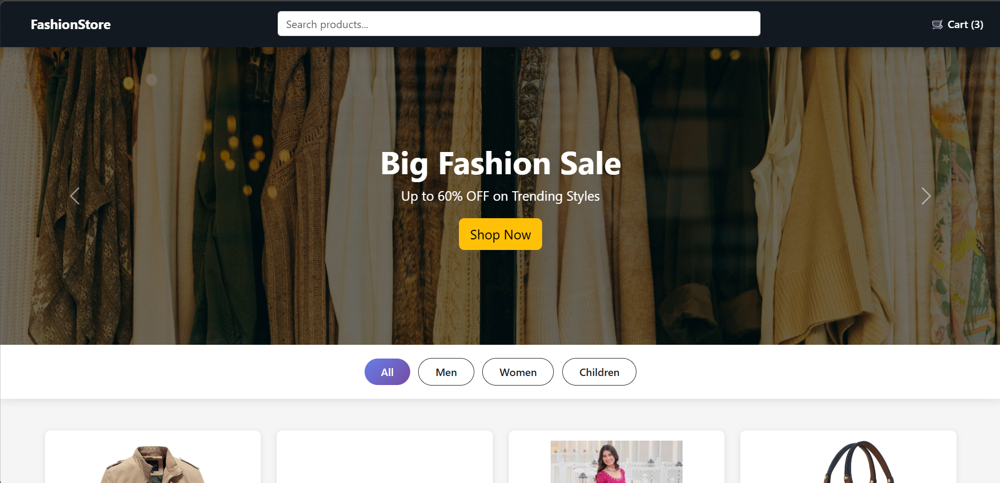
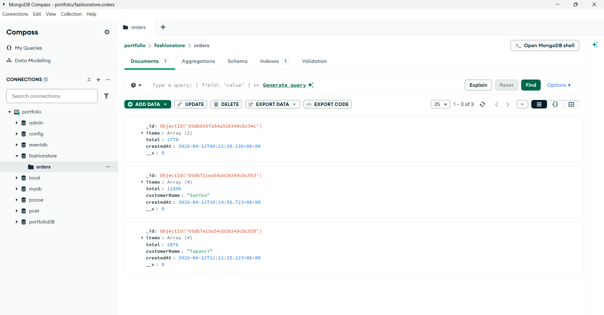

# Assignment 6: E-Commerce Website with Database Connection

## Problem Statement
Design and develop an e-commerce website that allows users to browse products, add items to a shopping cart, and checkout with order persistence in a MongoDB database using a Node.js backend.

## Objective
- To understand the integration of frontend and backend in a web application.
- To implement product display, cart interaction, and order submission.
- To practice full-stack development using HTML, CSS, JavaScript, Node.js, Express, and MongoDB.
- To enhance user interface design, webpage functionality, and data persistence.

## Technologies Used
- HTML
- CSS
- JavaScript
- Node.js
- Express.js
- MongoDB
- Mongoose

## Description
This assignment demonstrates the development of a full-stack e-commerce web application. The frontend allows users to view products, add them to a cart, and checkout. The backend handles order submission, calculates totals server-side, and persists orders in MongoDB.

HTML is used for webpage structure, CSS for styling and layout, JavaScript for frontend interactivity, Node.js and Express for the backend API, and MongoDB with Mongoose for data storage.

The website includes product display, cart functionality, checkout with customer name input, and order storage.

## Features
- Product listing with images, details, and ratings.
- Add to cart functionality with local storage.
- Checkout process with customer name prompt and order submission.
- Backend API for order creation and retrieval.
- Server-side total calculation from item prices and quantities.
- MongoDB storage for orders with items, total, customer name, and timestamp.
- Responsive webpage layout.

## Folder Structure
Ass6_Ecommerce_db_connection/
│
├── index.html
├── cart.html
├── style.css
├── script.js
├── README.md
├── backend/
│   ├── package.json
│   ├── server.js
│   ├── models/
│   │   ├── Contact.js
│   │   └── Project.js
│   └── .env.example
└── Outputs/
    ├── 1.png
    ├── 2.png
    ├── 3.png
    └── 4.png

## Outputs

### Output 1

### Output 2

### Output 3

### Output 4

## Backend Setup
To run the backend:
1. Navigate to `backend` folder.
2. Copy `.env.example` to `.env` and set `MONGODB_URI` (default: mongodb://localhost:27017/fashionstore).
3. Run `npm install`.
4. Run `npm start` (starts server on port 3000).

The frontend posts orders to `http://localhost:3000/api/orders` and stores them in MongoDB.

## Conclusion
This assignment provided experience in building a full-stack e-commerce application, integrating frontend with backend, and implementing data persistence with MongoDB. It demonstrated the complete flow from user interaction to database storage.