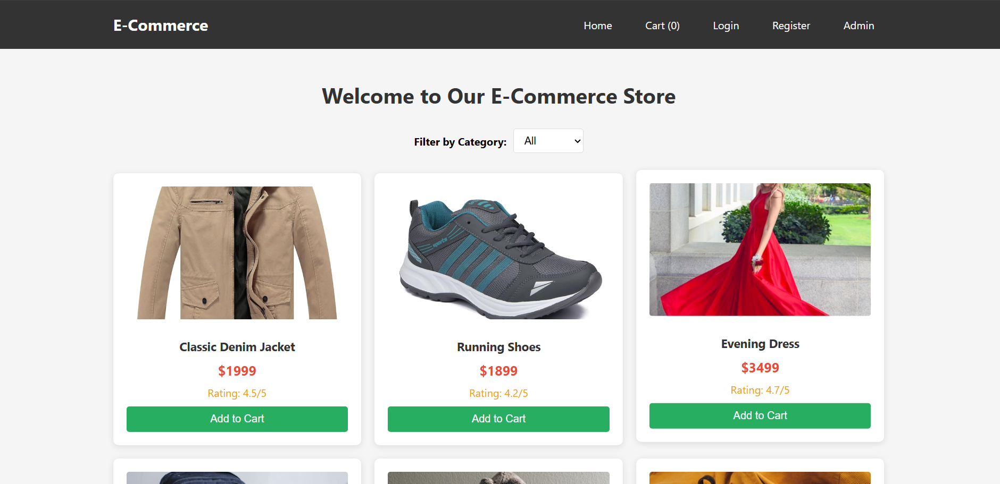
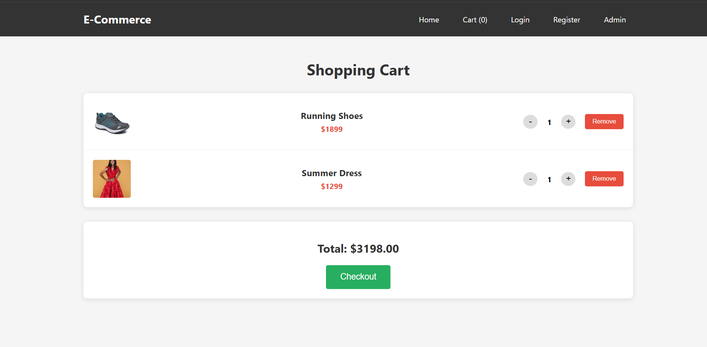
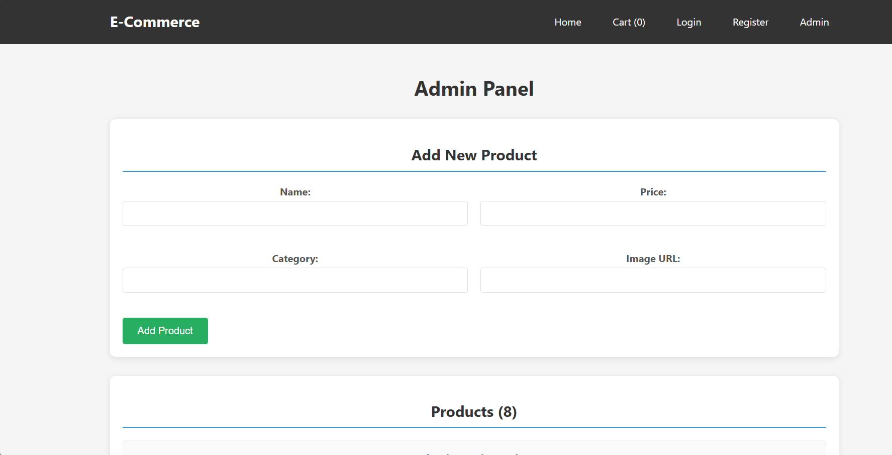
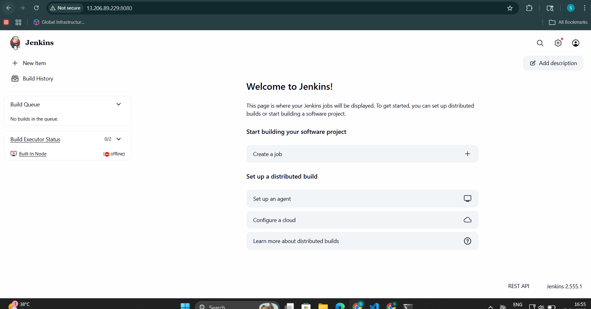
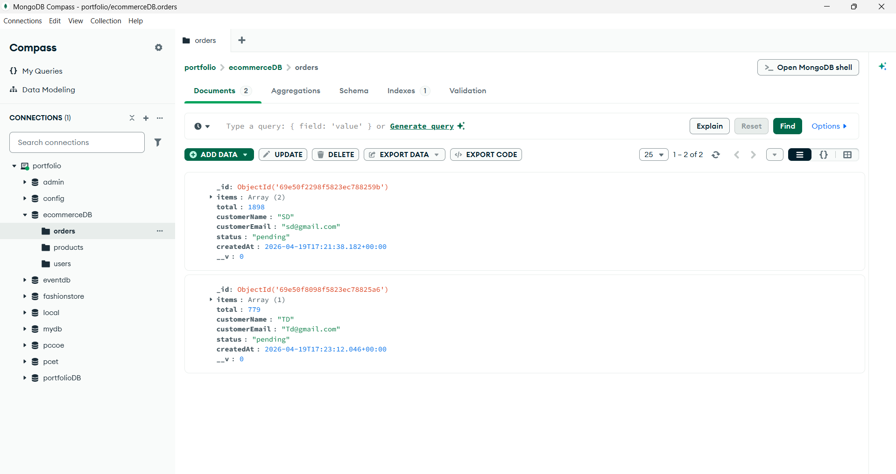
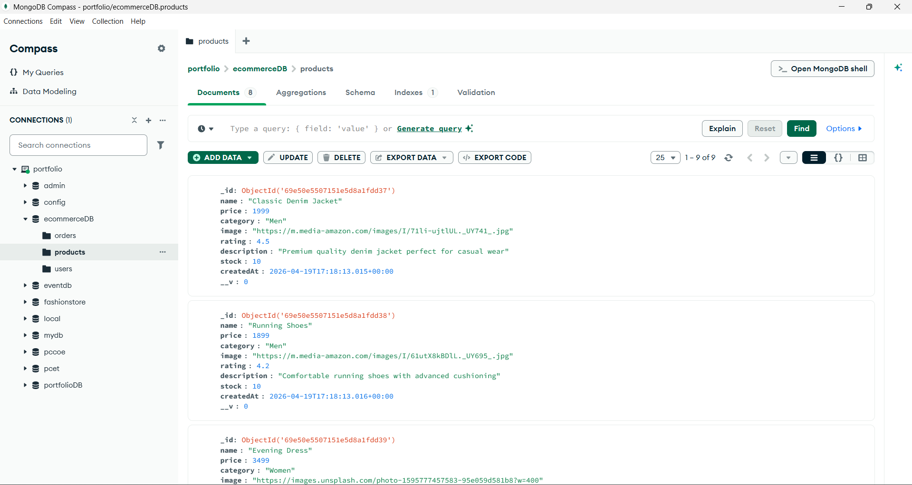
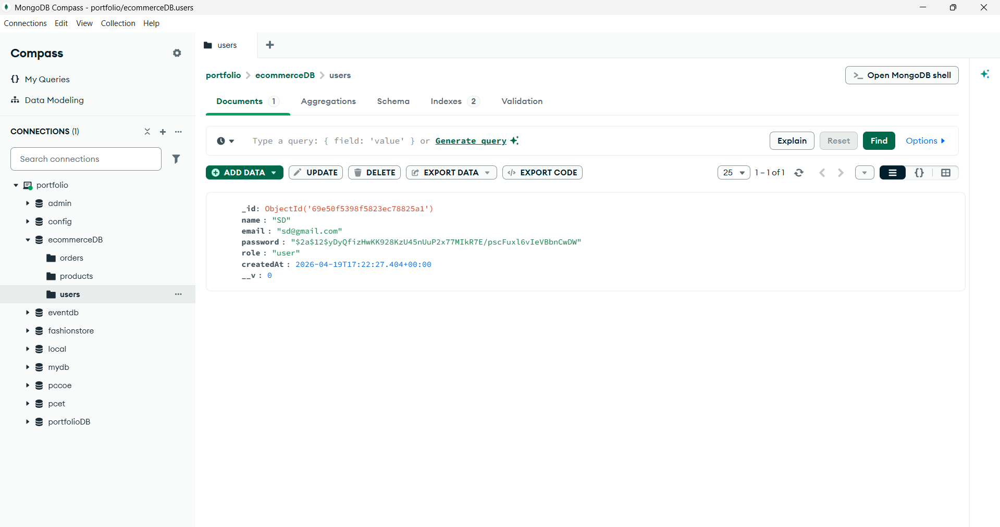

# E-commerce Application

A full-stack e-commerce application built with React.js and Express.js, featuring MongoDB for data storage.

## Features

- **User Authentication**: Register and login functionality
- **Product Management**: Browse products by categories (Electronics, Clothing, Books, etc.)
- **Shopping Cart**: Add, remove, and update cart items
- **Order Management**: Place orders and track them
- **Admin Dashboard**: Manage products and view orders
- **Responsive Design**: Works on desktop and mobile devices

## Tech Stack

### Frontend
- React.js
- React Router for navigation
- Axios for API calls
- CSS for styling

### Backend
- Node.js
- Express.js
- MongoDB with Mongoose
- JWT for authentication
- bcryptjs for password hashing

## Project Structure

```
Ass7_Ecommerce_node/
├── backend/
│   ├── models/
│   │   ├── Product.js
│   │   ├── Order.js
│   │   └── User.js
│   ├── package.json
│   └── server.js
├── frontend/
│   ├── public/
│   ├── src/
│   │   ├── components/
│   │   │   └── Navbar.js
│   │   ├── pages/
│   │   │   ├── Home.js
│   │   │   ├── Cart.js
│   │   │   ├── Login.js
│   │   │   ├── Register.js
│   │   │   └── Admin.js
│   │   ├── App.js
│   │   └── index.js
│   └── package.json
├── Outputs/
│   ├── 1.png
│   ├── 2.png
│   ├── 3.png
│   ├── 4.png
│   ├── 5.png
│   ├── 6.png
│   └── 7.png
└── README.md
```

## Installation & Setup

### Backend Setup
1. Navigate to the backend directory:
   ```bash
   cd backend
   ```

2. Install dependencies:
   ```bash
   npm install
   ```

3. Create a `.env` file in the backend directory with:
   ```
   MONGODB_URI=mongodb://127.0.0.1:27017/ecommerceDB
   JWT_SECRET=your-secret-key-here
   PORT=5000
   ```

4. Start the backend server:
   ```bash
   npm start
   ```

### Frontend Setup
1. Navigate to the frontend directory:
   ```bash
   cd frontend
   ```

2. Install dependencies:
   ```bash
   npm install
   ```

3. Start the React development server:
   ```bash
   npm start
   ```

## Usage

1. **Browse Products**: Visit the home page to see all products
2. **Filter by Category**: Use the category dropdown to filter products
3. **Add to Cart**: Click "Add to Cart" on any product
4. **View Cart**: Click the Cart link in the navbar
5. **Checkout**: Login and place your order
6. **Admin Access**: Visit the Admin page to manage products and view orders

## API Endpoints

### Authentication
- `POST /api/auth/register` - Register a new user
- `POST /api/auth/login` - Login user

### Products
- `GET /api/products` - Get all products
- `POST /api/products` - Add new product (admin only)
- `DELETE /api/products/:id` - Delete a product (admin only)

### Orders
- `POST /api/orders` - Create new order
- `GET /api/orders` - Get all orders (admin only)

## Screenshots

### 1. Home Page - Product Catalog


### 2. Product Filtering


### 3. Shopping Cart


### 4. User Registration


### 5. User Login


### 6. Admin Dashboard


### 7. Order Management


