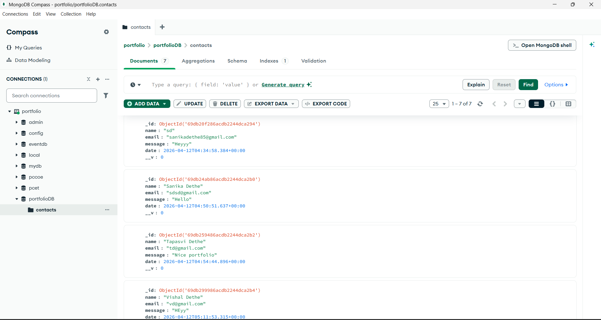

# Full Stack Development Term Work
This repository contains all assignments and practical work completed for the Full Stack Development course.

## Student Information
Name: Sanika Dethe  
Course: Full Stack Development  
College: Pimpri Chinchwad College of Engineering (PCCoE)  
Academic Year: 2025-26  

# Assignment 1: HTML Tags Table

## Problem Statement
Create an HTML webpage that displays commonly used HTML tags along with their syntax and description in a structured table format.

## Objective
To understand basic HTML structure and commonly used HTML tags.

## Technologies Used
- HTML, CSS

## Description
This assignment demonstrates the usage of basic HTML tags by presenting them in a table format. Each row contains the tag name, its syntax, and a brief description.

## Output
### Output 1

### Output 2


---

# Assignment 2 – Personal Portfolio Website

**Objective:**  
To design and develop a personal portfolio website using HTML and CSS.

**Description:**  
This portfolio website showcases personal information, skills, projects, and contact details in a structured and visually appealing layout.

**Technologies Used:**  
- HTML  
- CSS  

## Output
### Output 1

### Output 2


---

## Certification

As part of the course requirement, a certification related to Full Stack Development has been completed.

📄 **Certificate:**  

[View Certificate](FSD%20Certificate.pdf)

---

# Assignment 3: E-Commerce Website

## Objective
To design and implement a basic e-commerce web application interface using HTML, CSS, and JavaScript.

## Description
This assignment demonstrates a simple e-commerce webpage where users can browse products and interact with a shopping cart interface. It includes product display, cart functionality, and responsive styling.

## Technologies Used
- HTML
- CSS
- JavaScript

## Outputs

### Output 1


### Output 2


### Output 3


---

# Assignment 4: Weather Dashboard

## Objective
To understand the development of a real-time data visualization dashboard with interactive charts and graphs for weather data representation.

## Description
This assignment demonstrates the development of an interactive weather dashboard interface. The application displays current weather conditions such as temperature, humidity, wind speed, and pressure. Charts are used to visualize weather trends, including temperature changes over time, humidity vs precipitation comparison, and wind speed distribution. The dashboard includes a refresh feature that updates the data dynamically.

## Technologies Used
- HTML
- CSS
- JavaScript
- Chart.js

## Features
- Display of current weather statistics (Temperature, Humidity, Wind Speed, Pressure).
- Interactive charts:
  - Temperature trend (Line Chart)
  - Humidity vs Precipitation (Bar Chart)
  - Wind speed distribution (Pie Chart)
- Dynamic data update using JavaScript.
- Responsive and modern UI design.
- Refresh button to simulate real-time updates.

## Outputs

### Output 1


### Output 2


---

# Assignment 5: Portfolio Website with MongoDB Integration

## Objective
- To build a full stack web application
- To integrate frontend with backend using Node.js and Express
- To connect and perform operations using MongoDB
- To manage dynamic data such as contact form or user details

## Description
This assignment demonstrates the development of a dynamic portfolio website integrated with a backend server and database. The frontend is designed using HTML and CSS to showcase personal information, projects, and contact details. The backend is developed using Node.js and Express to handle routing and server-side logic. MongoDB is used as a NoSQL database to store and retrieve data such as user inputs from forms.

## Technologies Used
- HTML
- CSS
- JavaScript
- Node.js
- Express.js
- MongoDB

## Features
- Personal portfolio interface
- Backend server using Express.js
- MongoDB database integration
- Data storage and retrieval (e.g., contact form submissions)
- Organized project structure (frontend + backend)
- Responsive and clean UI

## Steps to Run the Project

### 1. Install Dependencies
```
npm install
```

### 2. Setup MongoDB
- Install MongoDB locally OR use MongoDB Atlas
- Create a database and collection
- Update the MongoDB connection string in `.env` or `server.js`

### 3. Run the Server
```
node server.js
```
or
```
nodemon server.js
```

## Outputs

### Output 1


### Output 2


### Output 3


### Output 4


### Output 5


---

# Assignment 6: E-Commerce Website with Database Connection

## Objective
- To understand the integration of frontend and backend in a web application
- To implement product display, cart interaction, and order submission
- To practice full-stack development using HTML, CSS, JavaScript, Node.js, Express, and MongoDB
- To enhance user interface design, webpage functionality, and data persistence

## Description
This assignment demonstrates the development of a full-stack e-commerce web application. The frontend allows users to view products, add them to a cart, and checkout. The backend handles order submission, calculates totals server-side, and persists orders in MongoDB. The website includes product display, cart functionality, checkout with customer name input, and order storage.

## Technologies Used
- HTML
- CSS
- JavaScript
- Node.js
- Express.js
- MongoDB
- Mongoose

## Features
- Product listing with images, details, and ratings
- Add to cart functionality with local storage
- Checkout process with customer name prompt and order submission
- Backend API for order creation and retrieval
- Server-side total calculation from item prices and quantities
- MongoDB storage for orders with items, total, customer name, and timestamp
- Responsive webpage layout

## Outputs

### Output 1


### Output 2


### Output 3


### Output 4
