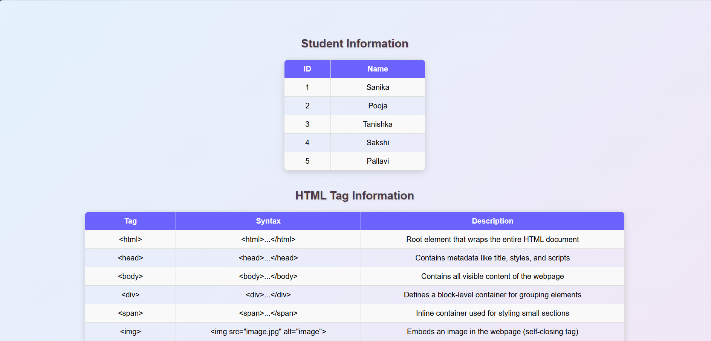
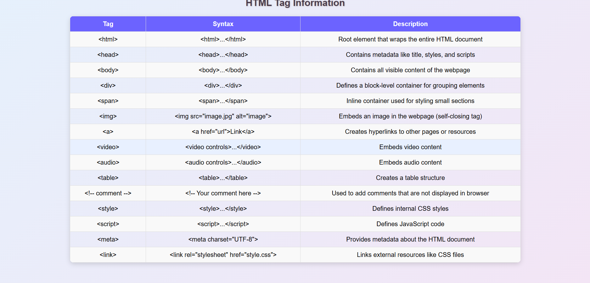

# Full Stack Development Term Work

## Student Information
Name: Sanika Dethe  
Course: Full Stack Development  
College: Pimpri Chinchwad College of Engineering (PCCoE)  
Academic Year: 2025-26  

# Assignment 1: HTML Tags Table

## Problem Statement
Create an HTML webpage that displays commonly used HTML tags along with their syntax and description in a structured table format.

## Objective
To understand basic HTML structure and commonly used HTML tags.

## Technologies Used
- HTML, CSS

## Description
This assignment demonstrates the usage of basic HTML tags by presenting them in a table format. Each row contains the tag name, its syntax, and a brief description.

## Output
### Output 1

### Output 2

